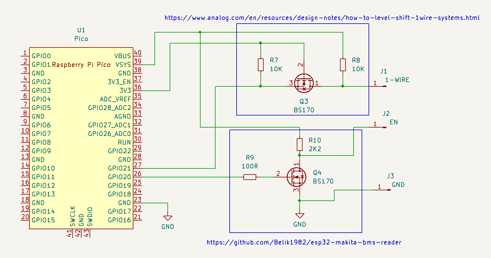
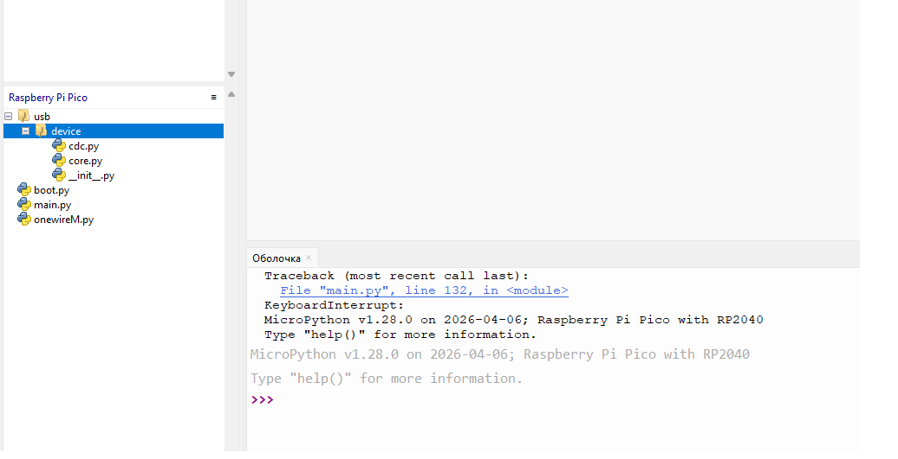

This project is for using Raspberry Pi Pico with OBI project https://github.com/mnh-jansson/open-battery-information

 

1. Install MicroPython to Pico
2. Use Thonny upload dir usb and files boot.py, main.py, onewireM.py

 

3. Start programm. Pico add two COM ports, first - REPL (MicroPython), second - CDC for connect OBI
